# Plant Growth Simulation 🌱

[](#)
[](#)


[](#)

## Descripción del proyecto

Plant Growth Simulation es una aplicación interactiva de consola que utiliza conceptos matemáticos, en particular derivadas y tasas de cambio, para simular el crecimiento de una planta en un entorno alienígena. El juego invita a los jugadores a gestionar recursos como el agua, la luz, los nutrientes, y otros factores ambientales, mientras toman decisiones estratégicas que afectan el desarrollo, salud y supervivencia de la planta. Además de ser una experiencia lúdica, este proyecto se propone como una herramienta educativa que refuerza conceptos matemáticos de manera práctica.

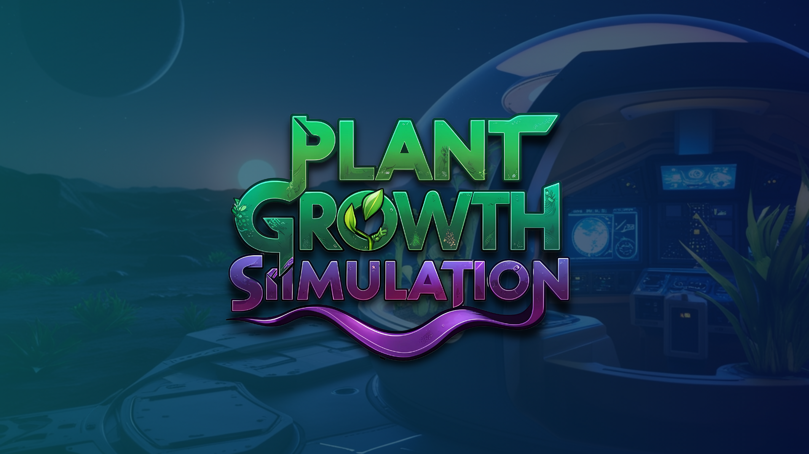

## Características

- Interfaz de consola interactiva.
- Simulación basada en derivadas y tasas de cambio para modelar el crecimiento de la planta.
- Gestión de recursos: agua, fertilizante y protección.
- Eventos aleatorios que afectan la salud, el tamaño, la contaminación y la temperatura de la planta.
- Modelo matemático que ilustra el impacto de pequeñas variaciones en el entorno.
- Optimización de algoritmos para un rendimiento eficiente en tiempo real.

## Requisitos Previos

- **Python 3.11**
- Dependencias instaladas mediante pip:
    - `colorama`
    - Se incluyen otros módulos propios como `clear-screen`
    - Además de módulos estándar de Python como `math`, `random` y `os`

## Instalación

Clona el repositorio

```bash
git clone https://github.com/GutBla/PROJECT_Plant_Growth_Simulation.git
```

Accede al directorio del proyecto

```bash
cd PROJECT_Plant_Growth_Simulation
```

1. Instala las dependencias:
    
    Si dispones de un archivo requirements.txt, usa:
    
    ```bash
    pip install -r requirements.txt
    ```
    
    O instálalas de forma individual:
    
    ```bash
    pip install colorama
    pip install clear_screen
    ```
    

## Uso

Para iniciar el juego, ejecuta el archivo principal:

```bash
python main.py
```

Sigue las instrucciones en pantalla para gestionar el crecimiento de tu planta en el entorno alienígena.

# **Historia**

En un futuro cercano, la Tierra ha alcanzado un punto crítico: los recursos naturales están al borde del agotamiento y las condiciones climáticas se han vuelto impredecibles. Ante este panorama, la humanidad ha comenzado su expansión hacia Marte y otros cuerpos celestes. Sin embargo, la verdadera colonización de estos planetas requiere algo fundamental: una fuente sostenible de alimentos en ambientes hostiles.

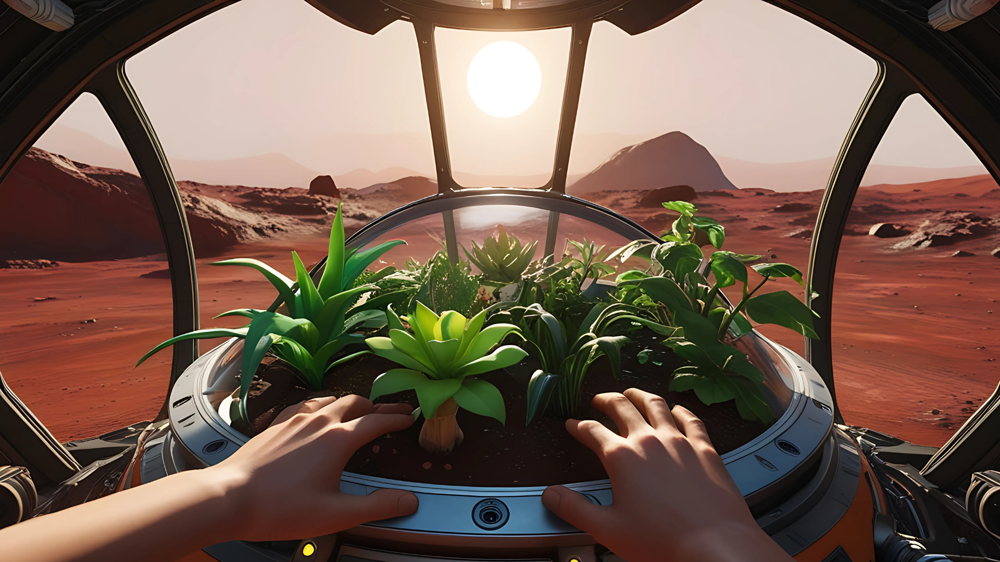

La Agencia Espacial Unificada (AEU), una coalición internacional conformada por los mejores científicos y exploradores, ha lanzado el ambicioso Proyecto Simulaciones de Vida. El objetivo es desarrollar un protocolo universal para la agricultura en planetas extraterrestres, lo cual no solo facilitaría la colonización, sino que también sería esencial para la supervivencia de futuras generaciones.

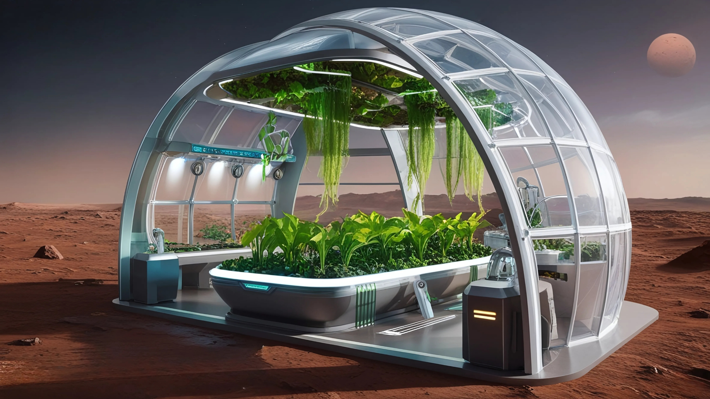

La simulación comienza en Gaiara, un planeta de pruebas con condiciones extremas. Aquí, los jugadores deben recolectar y gestionar recursos vitales para el crecimiento de una planta experimental. A medida que avanzan, se enfrentarán a nuevos planetas como Dunaris, Frostis, Vulcanis y Aetheris, cada uno con sus propios desafíos únicos que pondrán a prueba las habilidades de gestión y cálculo del jugador.

El éxito en Gaiara y en los planetas posteriores será clave para garantizar la supervivencia de la humanidad en nuevos mundos. Sin embargo, cada paso en esta travesía plantea una pregunta fundamental: ¿será suficiente esta nueva tecnología para garantizar nuestra existencia, o el cosmos guarda secretos que aún no estamos preparados para enfrentar?

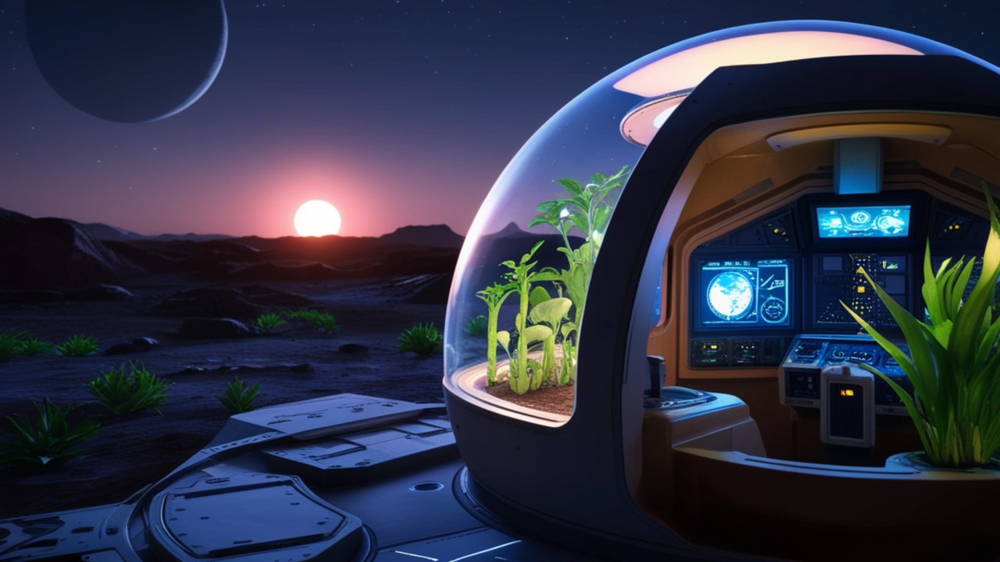

# **Metodología**

**Modelo de Crecimiento de la Planta:**

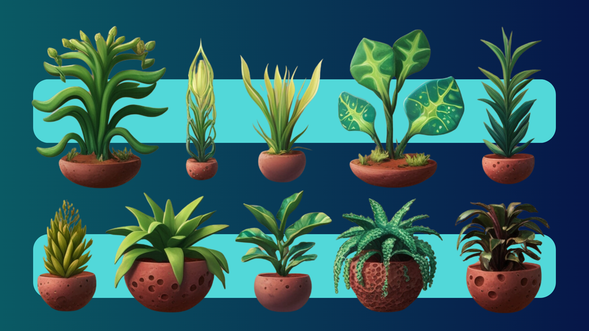

El crecimiento de la planta está basado en el cálculo de la derivada del tamaño e la planta respecto al tiempo. La función que describe este crecimiento es una combinación de su tamaño actual, tasa de crecimiento y el estado de salud.

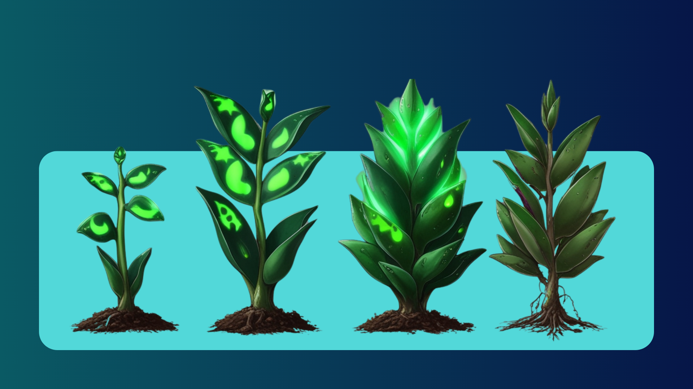

**Fórmula de la Derivada del Tamaño:**

$$
\frac{d(\text{tamaño})}{dt}= \bigl(\text{tamaño\_actual} + \text{tasa\_crecimiento}\bigr)  \times \frac{\text{salud}}{100}
$$

**Explicación:**

- **tamaño_actual** representa el tamaño de la planta en el instante actual.
- ***tasa_crecimiento*** es la tasa de crecimiento de la planta, es decir, el incremento en el tamaño de la planta por unidad de tiempo.
- **salud/100** es un factor de ajuste que escala la salud de la planta entre 0 y 1. Si la salud es alta, la planta crece más rápido, mientras que una baja salud ralentiza el crecimiento.

El crecimiento se modela como una función dependiente del tiempo, ajustada según el estado de salud de la planta.


```latex
\begin{tikzpicture}
\begin{axis}[
    title={Derivada del Tamaño vs. Tiempo},
    xlabel={Tiempo (días)},
    ylabel={$\frac{d(\text{tamaño})}{dt}$},
    domain=0:50,
    samples=200,
    grid=major
]
\addplot[
    thick,
    blue
]
{ ((x + 10) + 2) * ((100 - x)/100) };
\end{axis}
\end{tikzpicture}
```

**Cálculo del Daño a la Salud:**

El daño acumulado a la salud de la planta depende de factores ambientales, como la temperatura y la contaminación. La integral que describe este daño se calcula durante un intervalo de tiempo dado.

**Fórmula del Daño Acumulado a la Salud:**

$$
\text{daño\_acumulado}= \bigl(\text{Temperatura} + \text{Contaminación}\bigr)  \times \text{Días}
$$

La nueva salud de la planta es el valor de la salud inicial menos el daño acumulado:

$$
\text{salud\_nueva}
= \text{salud\_actual}
  - \text{daño\_acumulado}
$$

Finalmente, la salud se ajusta para no exceder los valores entre 0 y 100%:

$$
\text{salud\_final}
= \max\bigl(0,\,\min(\text{salud\_nueva},\,100)\bigr)
$$

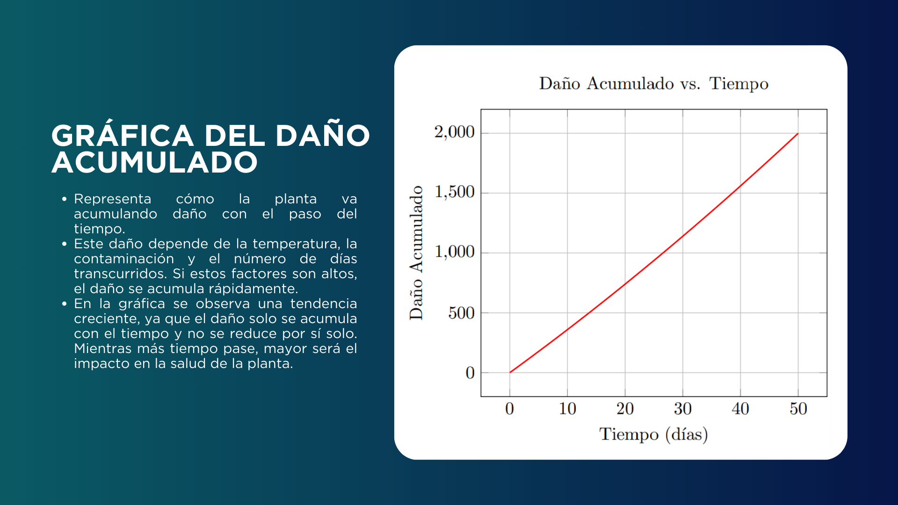

```latex
\begin{tikzpicture}
\begin{axis}[
    title={Daño Acumulado vs. Tiempo},
    xlabel={Tiempo (días)},
    ylabel={Daño Acumulado},
    domain=0:50,
    samples=200,
    grid=major
]
\addplot[
    thick,
    red
]
{ (25 + (10 + 0.1*x)) * x };
\end{axis}
\end{tikzpicture}
```

**Explicación:**

- **Daño Acumulado**: es el daño que se acumula debido a la exposición a condiciones ambientales como temperatura y contaminación durante un período de tiempo determinado.
- **Salud Nueva:** es la salud de la planta después de descontar el daño acumulado.
- La función asegura que la salud no caiga por debajo de 0% ni suba por encima del 100%.

$$
 \max\bigl(0,\,\min(\text{salud\_nueva},\,100)\bigr)
$$

Este modelo refleja cómo los factores ambientales afectan la salud de la planta a lo largo del tiempo.

**Cálculo de la Contaminación:**

La contaminación se modela como una función lineal en el tiempo, incrementándose cada día con un valor constante.

**Fórmula de Crecimiento de la Contaminación:**

$$
\text{contaminación\_futura}= \text{contaminación\_actual}  + 0.1 \times \text{días}
$$

**Explicación:**

- **contaminacion_actual:** es el nivel de contaminación inicial.
- 0.10.1 es el incremento diario de la contaminación.
- **días:** es el número de días transcurridos.

Cada día, la contaminación aumenta en 0.1, lo que refleja un crecimiento constante a lo largo del tiempo.

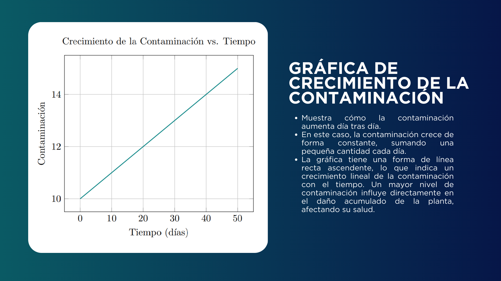

```latex
\begin{tikzpicture}
\begin{axis}[
    title={Crecimiento de la Contaminación vs. Tiempo},
    xlabel={Tiempo (días)},
    ylabel={Contaminación},
    domain=0:50,
    samples=200,
    grid=major
]
\addplot[
    thick,
    teal
]
{ 10 + 0.1*x };
\end{axis}
\end{tikzpicture}
```

**Notificaciones Interactivas:**

El juego incluye notificaciones interactivas en momentos clave, donde el jugador debe resolver problemas matemáticos relacionados con derivadas e integrales. Este componente está diseñado para reforzar el aprendizaje de los conceptos matemáticos aplicados en situaciones reales, como el crecimiento de la planta y los efectos ambientales.

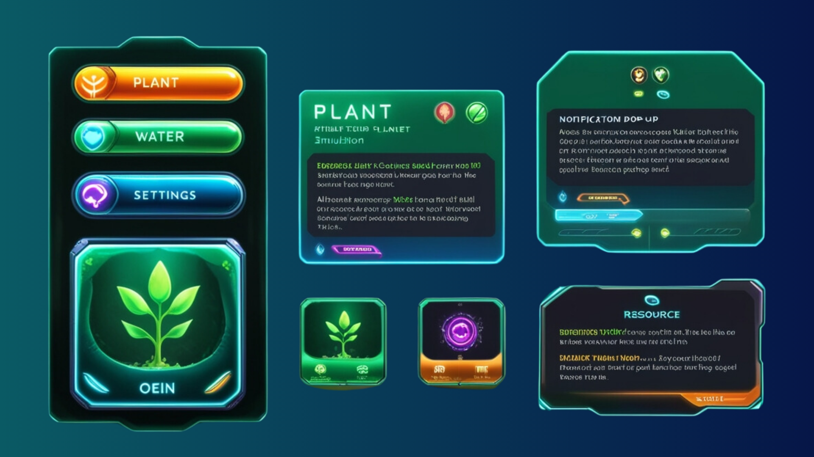

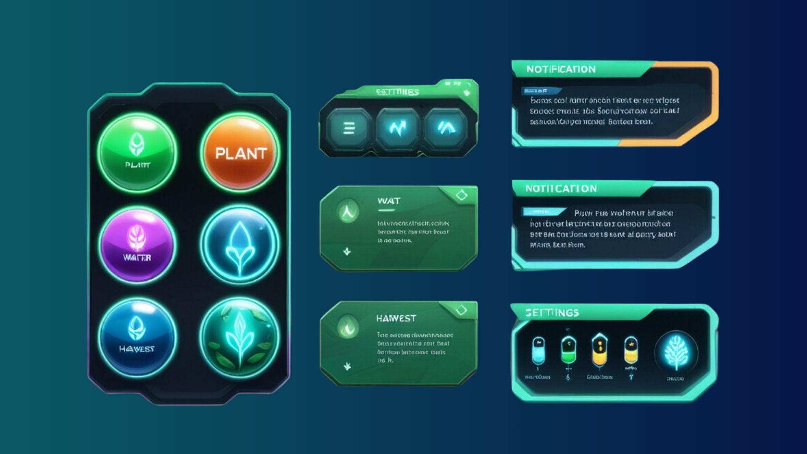

# **6. Descripción de los Planetas**

A continuación, se describen los planetas en los que se desarrolla el juego y los desafíos específicos que enfrentan:

### Ficha Técnica del Planeta: Gaiara

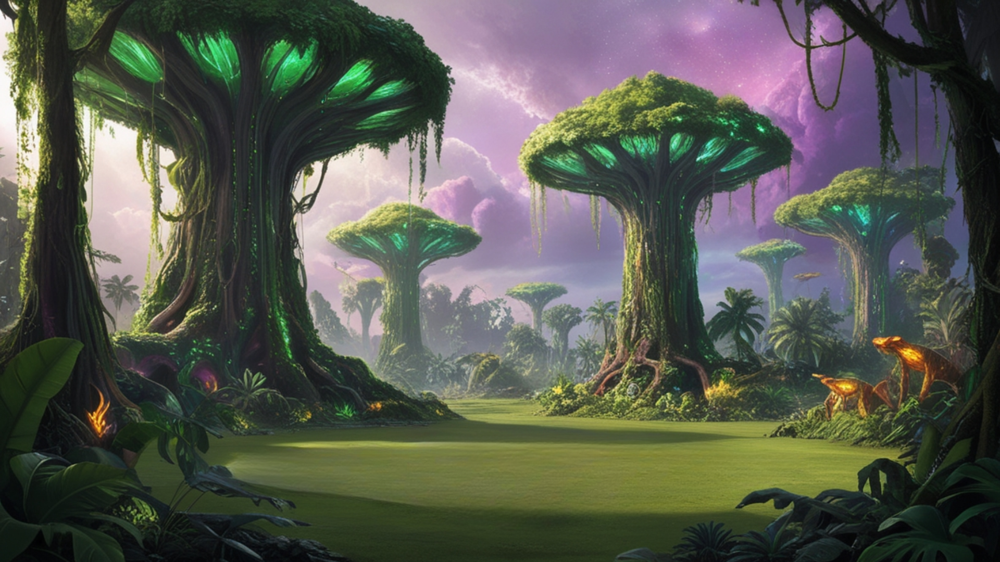

| **Categoría** | **Descripción** |
| --- | --- |
| *Nombre del Planeta* | Gaiara |
| *Tipo de Planeta* | Rocoso, de condiciones moderadas |
| *Ubicación* | Sistema estelar desconocido, a 1.5 años luz de la Tierra |
| *Diámetro* | 12,500 km |
| *Gravedad* | 0.92 g (similar a la gravedad terrestre) |
| *Composición de la Atmósfera* | 78% CO₂, 15% N₂, 7% O₂ |
| *Temperatura Promedio* | -10°C a 30°C |
| *Radiación Solar* | Moderada (afecta el crecimiento de las plantas) |
| *Nivel de Contaminación* | Moderado (partículas tóxicas en suspensión que afectan la salud de la flora) |
| *Humedad* | Variable, entre 20% y 80%, con lluvias esporádicas |
| *Recursos Naturales* | Minerales (fósforo, potasio), agua subterránea en cantidades limitadas |
| *Atmósfera* | Cielo gris azulado, tormentas solares ocasionales |
| *Vientos* | Ligeros, de 5-10 km/h, sin cambios drásticos en la dirección |
| *Topografía* | Llanuras áridas, montañas bajas con grietas emisoras de vapor |
| *Luz Solar* | Constante durante el día, con variación durante tormentas solares |
| *Agua Disponible* | Subterránea, extraíble mediante sistemas avanzados |
| *Nivel de Radiación* | Moderado, requiere protección para la vegetación |
| *Ecosistema* | Flora adaptada a condiciones extremas, fauna microscópica que se adapta al ambiente |
| *Posibilidades de Cultivo* | Potencial para el cultivo limitado de plantas mediante control preciso de recursos |
| *Riesgos para la Vegetación* | Radiación solar, falta de nutrientes en el suelo, variabilidad de humedad |

### Ficha Técnica del Planeta: Dunaris

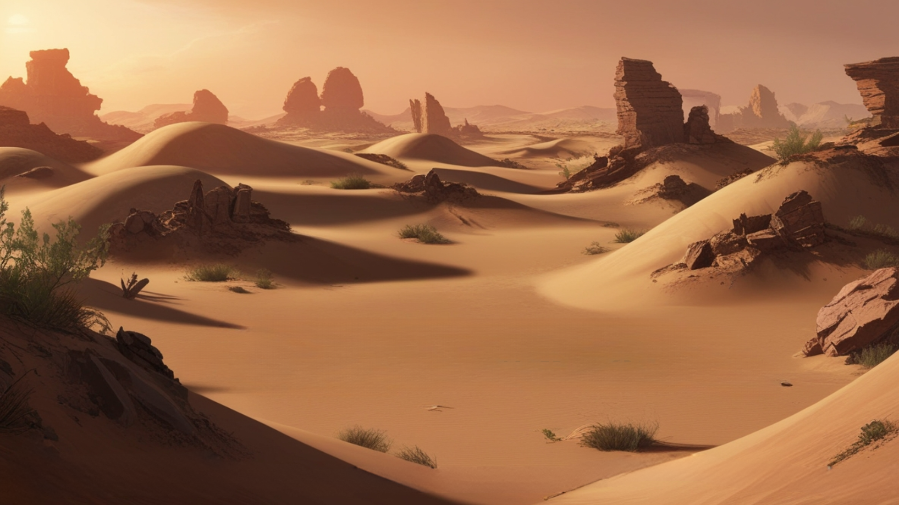

| **Categoría** | **Descripción** |
| --- | --- |
| *Nombre del Planeta* | Dunaris |
| *Tipo de Planeta* | Desértico |
| *Ubicación* | Sistema estelar cercano, a 0.8 años luz de la Tierra |
| *Diámetro* | 10,800 km |
| *Gravedad* | 0.85 g (ligeramente menor que la gravedad terrestre) |
| *Composición de la Atmósfera* | 96% CO₂, 4% N₂ |
| *Temperatura Promedio* | 35°C a 55°C |
| *Radiación Solar* | Alta (exposición directa y constante) |
| *Nivel de Contaminación* | Bajo (sin contaminación significativa) |
| *Humedad* | Muy baja, por debajo del 10% |
| *Recursos Naturales* | Pocos recursos minerales y agua escasa |
| *Atmósfera* | Cielo de tonos anaranjados debido a la mezcla de partículas de arena en suspensión |
| *Vientos* | Fuertes, con tormentas de arena frecuentes |
| *Topografía* | Desiertos infinitos con formaciones rocosas y cañones |
| *Luz Solar* | Intensa y constante durante el día |
| *Agua Disponible* | Subterránea en pequeñas cantidades, accesible solo mediante perforación |
| *Nivel de Radiación* | Alta, protección necesaria para los cultivos |
| *Ecosistema* | Escaso, con especies adaptadas a condiciones extremas |
| *Posibilidades de Cultivo* | Limitadas, con necesidad de optimizar el uso de recursos |
| *Riesgos para la Vegetación* | Calor extremo, escasez de agua, radiación solar intensa |

### Ficha Técnica del Planeta: Aquara

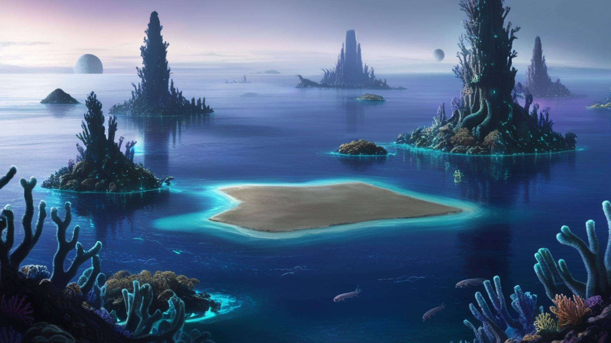

| **Categoría** | **Descripción** |
| --- | --- |
| *Nombre del Planeta* | Aquara |
| *Tipo de Planeta* | Oceánico |
| *Ubicación* | Sistema estelar lejano, a 2.1 años luz de la Tierra |
| *Diámetro* | 14,200 km |
| *Gravedad* | 1.02 g (ligeramente mayor que la gravedad terrestre) |
| *Composición de la Atmósfera* | 80% N₂, 10% O₂, 10% vapor de agua |
| *Temperatura Promedio* | 20°C a 40°C |
| *Radiación Solar* | Moderada, filtrada por la atmósfera densa |
| *Nivel de Contaminación* | Bajo, debido a la naturaleza acuática del planeta |
| *Humedad* | Alta, entre 80% y 95% |
| *Recursos Naturales* | Agua salada abundante, minerales extraíbles del fondo oceánico |
| *Atmósfera* | Densa, con nubes bajas y lluvias frecuentes |
| *Vientos* | Moderados, sin cambios significativos |
| *Topografía* | Amplios océanos con algunas islas esparcidas y fondos marinos ricos en vida |
| *Luz Solar* | Difusa debido a las nubes densas y la cobertura de agua |
| *Agua Disponible* | En abundancia, pero con salinidad que requiere purificación para el cultivo |
| *Nivel de Radiación* | Moderado, ideal para la fotosíntesis con protección adecuada |
| *Ecosistema* | Diverso en vida marina, pero poco suelo para cultivo terrestre |
| *Posibilidades de Cultivo* | Necesaria adaptación para cultivo en agua o en islas específicas |
| *Riesgos para la Vegetación* | Alta salinidad, adaptación difícil a la vida en agua sin tecnologías adecuadas |

### Ficha Técnica del Planeta: Frostis

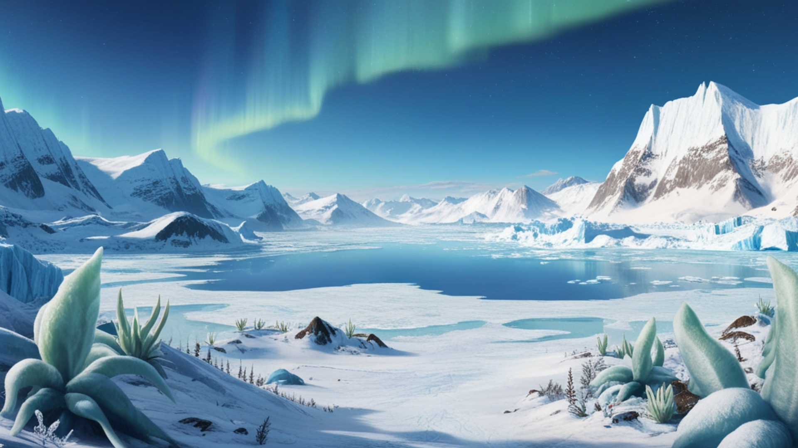

| **Categoría** | **Descripción** |
| --- | --- |
| *Nombre del Planeta* | Frostis |
| *Tipo de Planeta* | Helado |
| *Ubicación* | Sistema estelar distante, a 3 años luz de la Tierra |
| *Diámetro* | 13,000 km |
| *Gravedad* | 0.98 g (similar a la gravedad terrestre) |
| *Composición de la Atmósfera* | 78% N₂, 22% gases congelados (principalmente metano y amoníaco) |
| *Temperatura Promedio* | -50°C a -70°C |
| *Radiación Solar* | Baja, debido a la posición del planeta lejos del sol |
| *Nivel de Contaminación* | Muy bajo (ningún riesgo significativo de contaminación) |
| *Humedad* | Baja, debido a las bajas temperaturas, pero con nieve permanente |
| *Recursos Naturales* | Agua congelada, recursos limitados debido a las condiciones extremas |
| *Atmósfera* | Niebla constante, con gases inertes como el metano que pueden dificultar la respiración |
| *Vientos* | Fuertes, con tormentas de nieve y ventiscas repentinas |
| *Topografía* | Superficies heladas, montañas de hielo y capas gruesas de nieve |
| *Luz Solar* | Débil, con días muy cortos debido a la inclinación axial del planeta |
| *Agua Disponible* | Congelada, requiere tecnología avanzada para obtener agua líquida |
| *Nivel de Radiación* | Baja, pero temperaturas extremas requieren protección continua |
| *Ecosistema* | Sin vida terrestre conocida, aunque posibles formas de vida microscópica podrían existir |
| *Posibilidades de Cultivo* | Muy limitadas debido a las condiciones extremas de temperatura |
| *Riesgos para la Vegetación* | Temperaturas extremas, falta de agua líquida y bajos niveles de radiación solar |

### Ficha Técnica del Planeta: Vulcanis

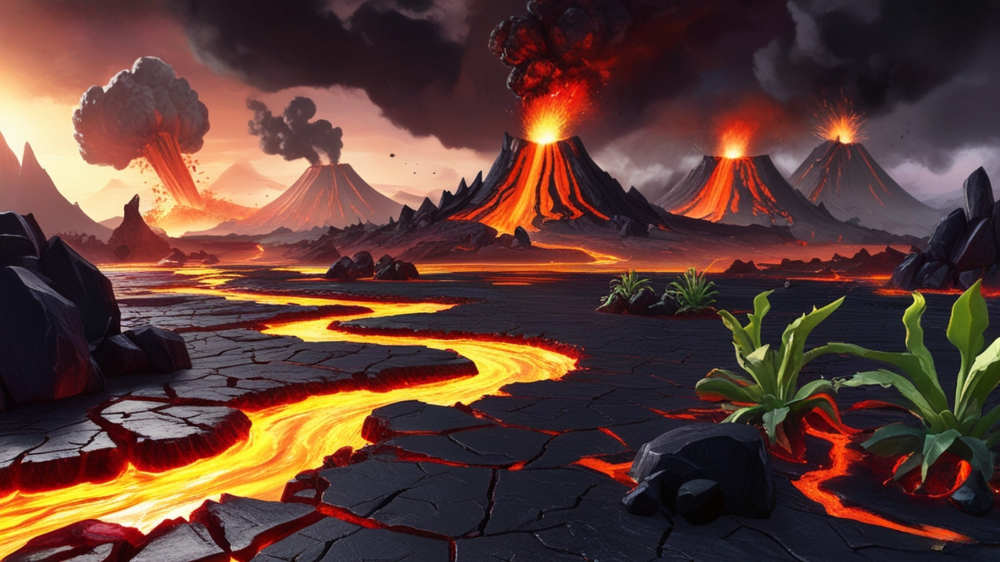

| **Categoría** | **Descripción** |
| --- | --- |
| *Nombre del Planeta* | Vulcanis |
| *Tipo de Planeta* | Volcánico |
| *Ubicación* | Sistema estelar cercano, a 1.2 años luz de la Tierra |
| *Diámetro* | 11,000 km |
| *Gravedad* | 1.1 g (ligeramente mayor que la gravedad terrestre) |
| *Composición de la Atmósfera* | 70% N₂, 25% CO₂, 5% SO₂ |
| *Temperatura Promedio* | 450°C a 700°C |
| *Radiación Solar* | Alta, debido a la cercanía con su estrella y la atmósfera cargada de gases |
| *Nivel de Contaminación* | Alto, debido a los gases volcánicos en la atmósfera |
| *Humedad* | Muy baja, casi inexistente debido a las altas temperaturas |
| *Recursos Naturales* | Minerales volcánicos, materiales geotérmicos que pueden ser aprovechados |
| *Atmósfera* | Nublada y llena de ceniza, con tormentas de lava frecuentes |
| *Vientos* | Fuertes, con partículas volcánicas suspendidas en la atmósfera |
| *Topografía* | Montañas volcánicas, lagos de lava, valles de ceniza |
| *Luz Solar* | Intensa durante el día, pero oscurecida por las tormentas de ceniza |
| *Agua Disponible* | En forma de vapor, requiere extracción y enfriamiento para la agricultura |
| *Nivel de Radiación* | Muy alto, por lo que se necesita protección avanzada para los cultivos |
| *Ecosistema* | Ausente de vida compleja, solo organismos extremófilos podrían habitar |
| *Posibilidades de Cultivo* | Muy limitadas debido a la temperatura extrema y la falta de agua |
| *Riesgos para la Vegetación* | Calor extremo, gases tóxicos, falta de agua y recursos alimenticios |

### Ficha Técnica del Planeta: Aetheris

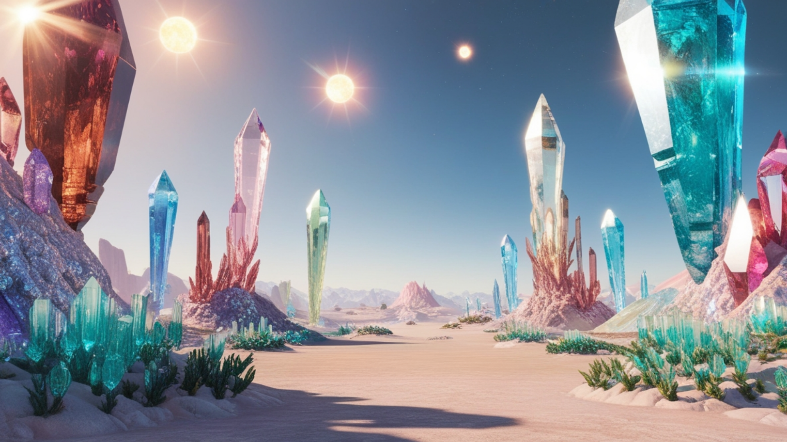

| **Categoría** | **Descripción** |
| --- | --- |
| *Nombre del Planeta* | Aetheris |
| *Tipo de Planeta* | Cristalino |
| *Ubicación* | Sistema estelar distante, a 1.7 años luz de la Tierra |
| *Diámetro* | 13,500 km |
| *Gravedad* | 1 g (igual que la gravedad terrestre) |
| *Composición de la Atmósfera* | 98% N₂, 2% O₂ |
| *Temperatura Promedio* | 10°C a 25°C |
| *Radiación Solar* | Alta, debido a las superficies reflejantes y la proximidad al sol |
| *Nivel de Contaminación* | Bajo, debido a la estabilidad del entorno |
| *Humedad* | Baja, entre 20% y 40% |
| *Recursos Naturales* | Minerales cristalinos, energía solar abundante |
| *Atmósfera* | Clara y ligera, con una atmósfera delgada que permite ver las estrellas con claridad |
| *Vientos* | Ligeros, con brisas constantes por la baja densidad atmosférica |
| *Topografía* | Llanuras de cristal, formaciones geométricas naturales |
| *Luz Solar* | Reflejada y difusa debido a la superficie altamente reflectante |
| *Agua Disponible* | Muy escasa, pero posible en pequeñas cantidades en zonas profundas |
| *Nivel de Radiación* | Alta, ideal para aprovechar la energía solar |
| *Ecosistema* | Flora cristalina que se adapta a la luz solar reflejada, vida microscópica |
| *Posibilidades de Cultivo* | Potencial de cultivo con adaptación a la energía solar y materiales cristalinos |
| *Riesgos para la Vegetación* | Exceso de luz solar, adaptación a la atmósfera liviana y energía solar intensa |

## Ejecución del proyecto

Adjunta capturas de pantalla que demuestren:

El menú principal del juego.


Historia y La selección de planeta.

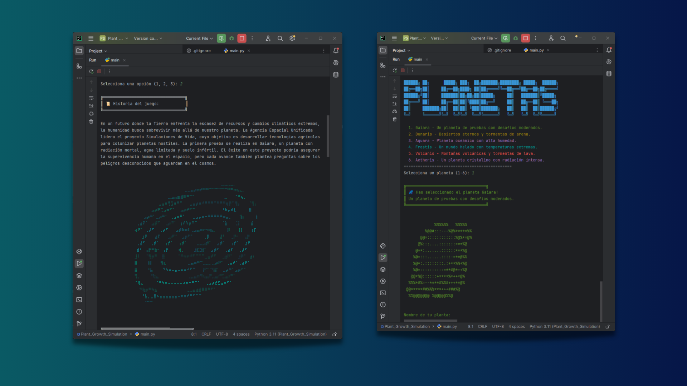

La simulación en curso.

